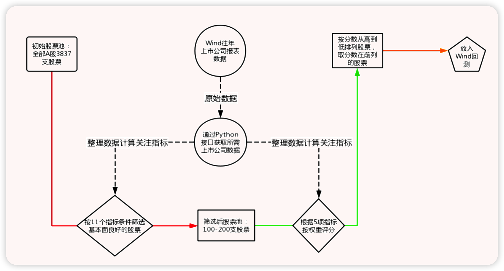
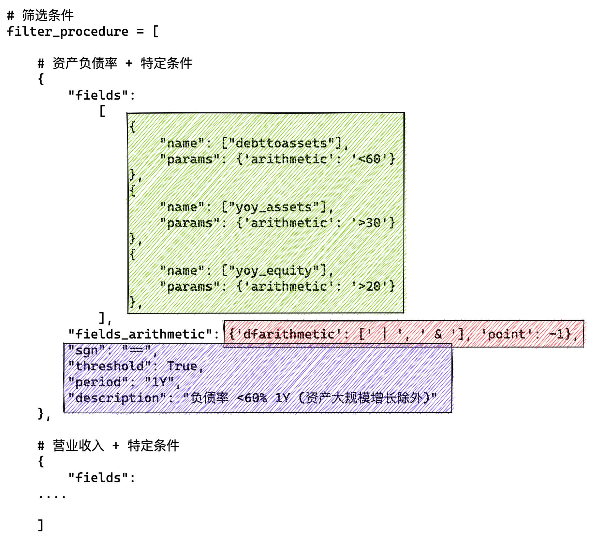
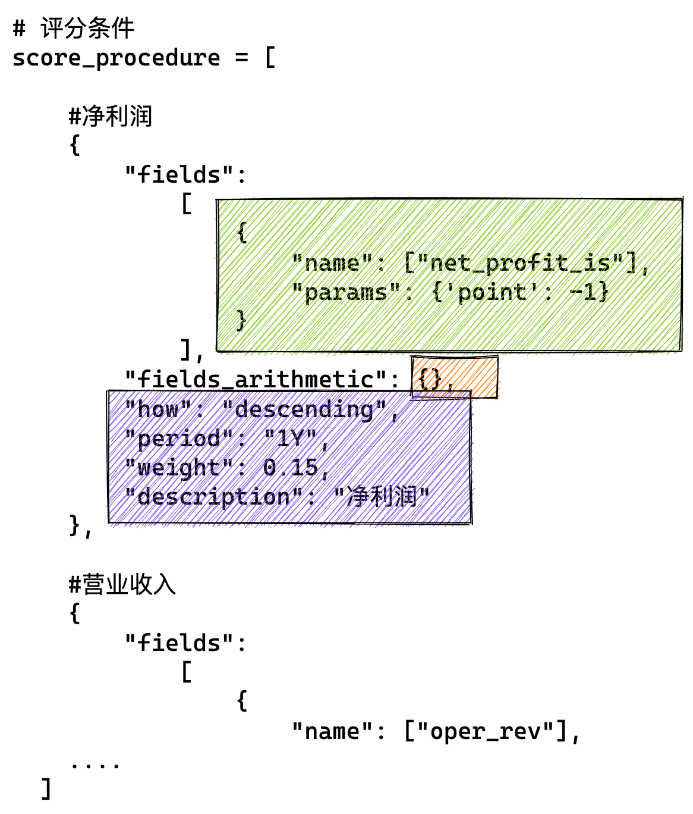

[TOC]

# Introduction

It is a China stock selection strategy with alpha factors.

**Author**: (Cholian) Chao Li

**Contributor**:  (Russell) Yuxuan Zhou

**Contact:** cholianli970518@gmail.com

# Environment

## Python

Version: Python3.9

```python
conda create -n alphaStock python=3.9
activate alphaStock 
conda install -c anaconda ipykernel
ipython kernel install --user --name=envname
```

```python
pip3 install pandas
pip3 install numpy
....
(TBA)
```

## Wind

Download: [Wind](https://www.wind.com.cn/NewSite/wft.html)

Install wind python add-in:

`Wind-我的-插件修复-修复Python接口`

## MySQL

```mysql
Wind
-stockdata
    --stock_code varchar(64) not null
    --date  date not null
-pg_tables
    --tablename varchar(255)
-constituents
    --sectorid varchar(20)
    --date date
    --stock_code varchar(9)
    --stock_name varchar(16)
```

## Run

```bash
python StockSelector_V2.0.py
```

## Output (example)

### Score

|           | stock_name | 总分    | 仓位权重 | 净利润 | 主营业务收入 | ROE复合增长率 3Y | 费用增速均值/营收增速均值  3Y | FCFF增速均值 3Y | PEG/净利润同比增速(wind一致预测)  1Y |
| --------- | ---------- | ------- | -------- | ------ | ------------ | ---------------- | ----------------------------- | --------------- | ------------------------------------ |
| 300142.SZ | 沃森生物   | 61.1273 | 0.0958   |        | 14.6771      | 1.1979           | 1.2826                        | 8.9697          | 35.0000                              |
| 000893.SZ | 亚钾国际   | 60.5953 | 0.0950   |        | 14.9365      | 15.0000          | 3.5965                        | 9.3629          | 17.6992                              |
| 600859.SH | 王府井     | 56.7175 | 0.0889   |        | 13.7608      | 5.8406           | 10.0000                       | 9.2494          | 17.8666                              |
| 300937.SZ | 药易购     | 51.3596 | 0.0805   |        | 14.6833      | 0.0000           | 0.1051                        | 8.8787          | 27.6926                              |
| 605090.SH | 九丰能源   | 49.0256 | 0.0769   |        | 13.1951      | 1.6207           | 5.2095                        | 0.0000          | 29.0002                              |
| 000668.SZ | 荣丰控股   | 46.4770 | 0.0729   |        | 14.9938      |                  | 1.4140                        | 9.6154          | 20.4537                              |
| 603329.SH | 上海雅仕   | 45.2905 | 0.0710   |        | 14.7629      | 4.3051           | 0.0000                        | 9.1685          | 17.0540                              |
| 605368.SH | 蓝天燃气   | 44.1114 | 0.0692   |        | 14.6339      | 3.0091           | 3.5489                        | 9.5837          | 13.3359                              |
| 002129.SZ | 中环股份   | 42.4666 | 0.0666   |        | 10.9644      | 5.6274           | 3.0350                        | 8.3181          | 14.5218                              |
| 832566.BJ | 梓橦宫     | 40.7383 | 0.0639   |        | 14.9769      | 2.8944           | 0.5458                        | 9.4335          | 12.8876                              |
| 300825.SZ | 阿尔特     | 39.2601 | 0.0615   |        | 14.8932      | 3.4032           | 1.5761                        | 6.7987          | 12.5889                              |
| 601225.SH | 陕西煤业   | 35.8590 | 0.0562   |        | 0.0000       | 3.5037           | 3.5146                        | 10.0000         | 18.8406                              |
| 300662.SZ | 科锐国际   | 32.8170 | 0.0514   |        | 14.3272      | 2.7413           | 2.3587                        | 6.9309          | 6.4589                               |
| 300987.SZ | 川网传媒   | 32.0281 | 0.0502   |        | 15.0000      | 3.2407           | 3.9659                        | 9.8216          | 0.0000                               |

### Backtesting for wind

| 证券代码  | 股票名称 | 总分     | 仓位权重 | 调整日期   | 成本价格 | 市值     | 持仓数量 |
| --------- | -------- | -------- | -------- | ---------- | -------- | -------- | -------- |
| 300142.SZ | 沃森生物 | 61.1273  | 9.5830%  | 2022-05-16 | 49.98    | 95829.86 | 1917     |
| 000893.SZ | 亚钾国际 | 60.59527 | 9.4996%  | 2022-05-16 | 39.02    | 94995.78 | 2434     |
| 600859.SH | 王府井   | 56.71747 | 8.8917%  | 2022-05-16 | 23.01    | 88916.53 | 3864     |
| 300937.SZ | 药易购   | 51.35964 | 8.0517%  | 2022-05-16 | 29.45    | 80517    | 2734     |
| 605090.SH | 九丰能源 | 49.02557 | 7.6858%  | 2022-05-16 | 27.31    | 76857.87 | 2814     |
| 000668.SZ | 荣丰控股 | 46.47696 | 7.2862%  | 2022-05-16 | 12.2     | 72862.38 | 5972     |
| 603329.SH | 上海雅仕 | 45.2905  | 7.1002%  | 2022-05-16 | 16.19    | 71002.36 | 4385     |
| 605368.SH | 蓝天燃气 | 44.11144 | 6.9154%  | 2022-05-16 | 13.04    | 69153.94 | 5303     |
| 002129.SZ | 中环股份 | 42.46664 | 6.6575%  | 2022-05-16 | 39.55    | 66575.36 | 1683     |
| 832566.BJ | 梓橦宫   | 40.73827 | 6.3866%  | 2022-05-16 | 16.9     | 63865.77 | 3779     |
| 300825.SZ | 阿尔特   | 39.2601  | 6.1548%  | 2022-05-16 | 19.17    | 61548.44 | 3210     |
| 601225.SH | 陕西煤业 | 35.85895 | 5.6216%  | 2022-05-16 | 17.26    | 56216.43 | 3257     |
| 300662.SZ | 科锐国际 | 32.81697 | 5.1447%  | 2022-05-16 | 48.52    | 51447.48 | 1060     |
| 300987.SZ | 川网传媒 | 32.02813 | 5.0211%  | 2022-05-16 | 20.03    | 50210.8  | 2506     |

# Main structure of the strategy



## Step1: Filter stocks according to the financial indicators

| 序号 | 具体指标                         | 筛选取值                                                     | 年份  |
| ---- | -------------------------------- | ------------------------------------------------------------ | ----- |
| 1    | 资产负债率                       | ＜60%，否则剔除                                              | 近1年 |
| 2    | 营业收入                         | 近三年营业收入复合增速（同比）＞15%，否则剔除                | 近3年 |
| 3    | EBITDA                           | 近三年EBITDA复合增速（同比）＞10%且无负值，否则剔除          | 近3年 |
| 4    | 扣非净利润                       | 近三年扣非净利润复合增速（环比）＞10，否则剔除，允许有负值   | 近3年 |
| 5    | ROA                              | 近三年ROA有提升（期末：期初）且绝对值不低于5                 | 近3年 |
| 6    | 总资产周转率+净利率（new）       | 近三年两项数据无同时下滑（期末：期初），否则剔除             | 近3年 |
| 7    | 毛利率                           | 综合毛利率＞15%，否则剔除                                    | 近3年 |
| 8    | 应收账款+应收票据增速/净利润增速 | 近三年(应收账款+应收票据)年均增速<净利润年均增速，否则剔除   | 近3年 |
| 9    | 经营性现金流净额OCF增长率        | 近三年年均增速不低于同期扣非净利润年均增速的50%，否则剔除    | 近3年 |
| 10   | 企业每股自由现金流（new）        | 近三年个年度每股企业自由现金流不能均为负值，否则剔除         | 近3年 |
| 11   | 研发支出占比                     | 近三年研发支出占同期营收占比>8%，否则剔除                    | 近3年 |
| 12   | 费用资本化率（new）              | 近三年累计开发支出＜研发支出的50%，否则剔除，开发支出占营收＜15%，否则剔除 | 近3年 |
| 13   | 审计意见                         | 保留“标准无保留意见”或“带强调事项段的无保留意见”的股票；否则剔除 | 近3年 |
| 14   | 应收账款、票据（new）            | 近三年应收账款+票据合计增速＜同期营业收入增速的1.5倍，否则剔除 | 近3年 |
| 15   | 商誉在净资产中的比重             | 近一年商誉在净资产中的比重<30%，否则剔除                     | 近1年 |
| 16   | PEG/PB（new）                    | 近一年PE/净利润增速<2.5且PB＜15，否则剔除                    | 近1年 |

## Step2: Give each stock a score

| 序号 | 具体指标                   | 筛选取值                                                     | 年份  | 打分权重 |
| ---- | -------------------------- | ------------------------------------------------------------ | ----- | -------- |
| 17   | 净利润增速（YTD）（new）   | 按当年净利润增速评分（wind一致预期值）评分，标准差           | 近1年 | 15%      |
| 18   | 营业收入增速（YTD）（new） | 按当年营收增速（wind一致预测值）评分，标准差                 | 近1年 | 15%      |
| 19   | ROE（new）                 | 按近三年ROE增长幅度评分（标准差）                            | 近3年 | 15%      |
| 20   | 三费年均增速与营收增速比率 | 按合计费用年均增速与营业收入年均增速的比率评分，越小分数越高 | 近3年 | 10%      |
| 21   | FCF                        | 按FCF年均增速评分，（A）税后净营业利润 + （B）折旧和摊销 - （C）资本支出 | 近3年 | 10%      |
| 22   | PEG（YTD）                 | 静态估值/当年净利润增速（wind一致预期值）评分，越小分数越高  | 近1年 | 35%      |

## Step3: Specific conditions

| 序号 | 具体指标              | 筛选取值                                                     | 年份  |
| ---- | --------------------- | ------------------------------------------------------------ | ----- |
| 26   | 资产大规模增长（new） | 筛选近一年总资产增长＞30且净资产增长＞20的公司，跳转至第7项开始筛选评分 | 近1年 |

# Main coding structure of the strategy
## Input

### filter_precedure



### score_precedure


## Processing


## Output

See the demo
