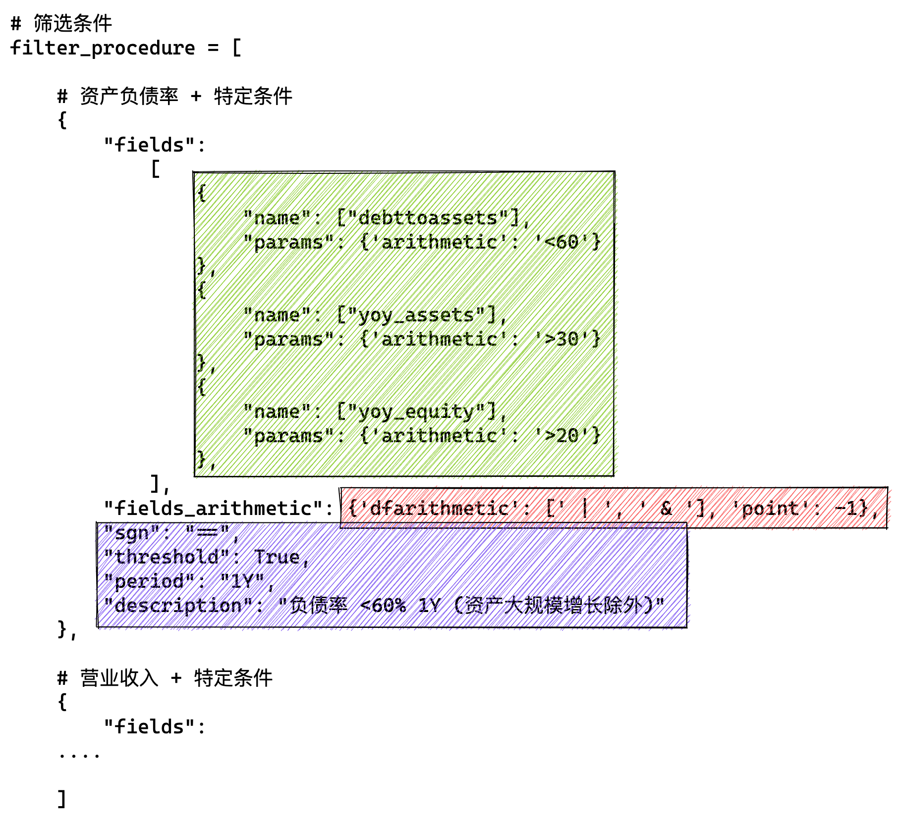
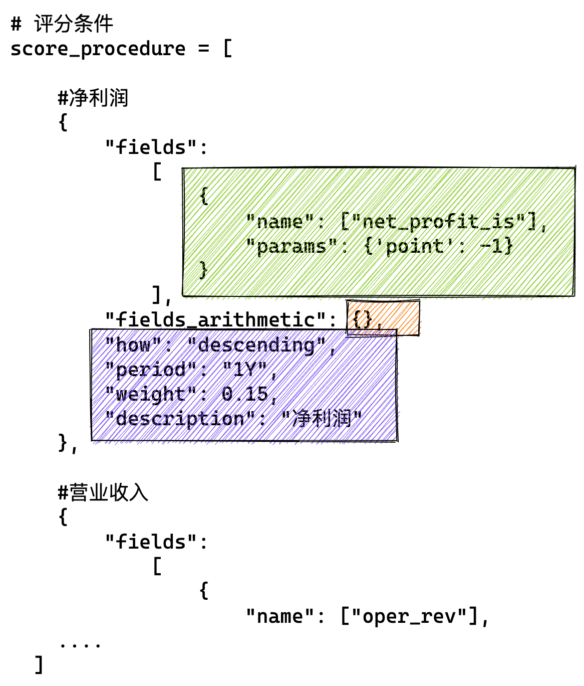
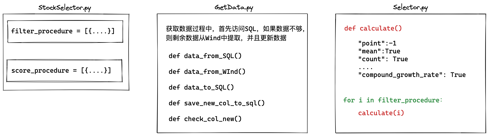

[TOC]

# Introduction

This project presents a Chinese stock selection strategy, utilizing a variety of financial indicators to evaluate and score stocks within the Chinese market. The strategy is designed to identify stocks with strong financial health and growth potential by applying rigorous filtering criteria and a multi-step scoring process.

## Key Features:

- **Comprehensive Financial Screening:** The strategy employs a broad range of financial indicators to filter out stocks that do not meet specific financial criteria, such as debt-to-asset ratio, revenue growth, EBITDA growth, and more.
- **Scoring Mechanism:** After filtering, each stock is given a score based on its financial performance across several metrics, including net profit growth, ROE growth, and free cash flow. This scoring helps rank stocks based on their potential for returns.
- **Dynamic Adjustments:** The algorithm incorporates dynamic conditions, such as large-scale asset growth, to ensure that the stock selection remains relevant and adaptive to changing market conditions.

## Objective:

The main objective of this algorithm is to systematically identify high-quality stocks within the Chinese market that are likely to outperform, based on their financial health and growth prospects. By applying both stringent filtering criteria and a detailed scoring system, the strategy aims to create a robust portfolio that balances growth potential with financial stability.

**Author**: (Cholian) Chao Li

**Contributor**:  (Russell) Yuxuan Zhou

**Contact:** cholianli970518@gmail.com

# Environment

## Python

Version: Python3.9

```python
conda create -n alphaStock python=3.9
activate alphaStock 
conda install -c anaconda ipykernel
ipython kernel install --user --name=envname
```

```python
pip3 install pandas
pip3 install numpy
....
(TBA)
```

## Wind

Download: [Wind](https://www.wind.com.cn/NewSite/wft.html)

Install wind python add-in:

`Wind-我的-插件修复-修复Python接口`

## MySQL

```mysql
Wind
-stockdata
    --stock_code varchar(64) not null
    --date  date not null
-pg_tables
    --tablename varchar(255)
-constituents
    --sectorid varchar(20)
    --date date
    --stock_code varchar(9)
    --stock_name varchar(16)
```

## Run

```bash
python StockSelector_V2.0.py
```

---

# The main structure of the strategy

## Step1: Filter stocks according to the financial indicators

| No.  | Specific Indicator                                           | Filter Value                                                 | Year         |
| ---- | ------------------------------------------------------------ | ------------------------------------------------------------ | ------------ |
| 1    | Debt-to-asset ratio                                          | ＜60%, otherwise eliminate                                   | Last 1 year  |
| 2    | Operating income                                             | Compound annual growth rate (YoY) > 15% in the last three years, otherwise eliminate | Last 3 years |
| 3    | EBITDA                                                       | Compound annual growth rate (YoY) > 10% and no negative value in the last three years, otherwise eliminate | Last 3 years |
| 4    | Net profit excluding non-recurring gains and losses          | Compound annual growth rate (QoQ) > 10% in the last three years, otherwise eliminate (negative values allowed) | Last 3 years |
| 5    | Return on assets (ROA)                                       | ROA has increased (end: beginning) and the absolute value is not lower than 5 in the last three years | Last 3 years |
| 6    | Total asset turnover + Net profit margin (new)               | Neither of the two indicators has declined simultaneously (end: beginning) in the last three years, otherwise eliminate | Last 3 years |
| 7    | Gross profit margin                                          | Comprehensive gross profit margin > 15%, otherwise eliminate | Last 3 years |
| 8    | Growth rate of accounts receivable + notes receivable / Growth rate of net profit | Annual growth rate of accounts receivable + notes receivable < Growth rate of net profit in the last three years, otherwise eliminate | Last 3 years |
| 9    | Growth rate of operating cash flow (OCF)                     | Average annual growth rate over the past three years is not lower than 50% of the average annual growth rate of net profit excluding non-recurring gains and losses, otherwise eliminate | Last 3 years |
| 10   | Free cash flow per share (new)                               | The company’s free cash flow per share cannot be negative in any of the last three years, otherwise eliminate | Last 3 years |
| 11   | Proportion of R&D expenditure                                | Proportion of R&D expenditure to revenue > 8% in the last three years, otherwise eliminate | Last 3 years |
| 12   | Capitalization rate of expenses (new)                        | Cumulative development expenditure < 50% of R&D expenditure in the last three years, otherwise eliminate; development expenditure to revenue < 15%, otherwise eliminate | Last 3 years |
| 13   | Audit opinion                                                | Retain stocks with "standard unqualified opinion" or "unqualified opinion with emphasis on matters"; otherwise eliminate | Last 3 years |
| 14   | Accounts receivable, notes (new)                             | Growth rate of accounts receivable + notes in the last three years < 1.5 times the growth rate of operating income in the same period, otherwise eliminate | Last 3 years |
| 15   | Proportion of goodwill to net assets                         | Proportion of goodwill to net assets < 30% in the last year, otherwise eliminate | Last 1 year  |
| 16   | PEG/PB (new)                                                 | PE/Growth rate of net profit < 2.5 and PB < 15 in the last year, otherwise eliminate | Last 1 year  |

## Step2: Give each stock a score

| No.  | Specific Indicator                                           | Filter Value                                                 | Year         | Scoring Weight |
| ---- | ------------------------------------------------------------ | ------------------------------------------------------------ | ------------ | -------------- |
| 17   | Net profit growth rate (YTD) (new)                           | Score based on the growth rate of net profit for the current year (wind consensus forecast), standard deviation | Last 1 year  | 15%            |
| 18   | Operating income growth rate (YTD) (new)                     | Score based on the growth rate of revenue for the current year (wind consensus forecast), standard deviation | Last 1 year  | 15%            |
| 19   | ROE (new)                                                    | Score based on the growth rate of ROE over the last three years (standard deviation) | Last 3 years | 15%            |
| 20   | Ratio of average annual growth rate of three expenses to revenue growth rate | Score based on the ratio of the average annual growth rate of total expenses to the average annual growth rate of operating income, the smaller the ratio, the higher the score | Last 3 years | 10%            |
| 21   | Free Cash Flow (FCF)                                         | Score based on the average annual growth rate of free cash flow, (A) Net operating profit after tax + (B) Depreciation and amortization - (C) Capital expenditures | Last 3 years | 10%            |
| 22   | PEG (YTD)                                                    | Static valuation / Growth rate of net profit for the current year (wind consensus forecast), the smaller the ratio, the higher the score | Last 1 year  | 35%            |

## Step3: Specific conditions

| No.  | Specific Indicator             | Filter Value                                                 | Year        |
| ---- | ------------------------------ | ------------------------------------------------------------ | ----------- |
| 26   | Large-scale asset growth (new) | Filter companies whose total assets have increased by >30% and net assets by >20% in the last year, and then proceed to the filtering and scoring from item 7 | Last 1 year |


# Result

## Score

|           | stock_name              | Total Score | Position Weight | Net Profit | Main Business Revenue | ROE Compound Growth Rate 3Y | Average Expense Growth Rate/Average Revenue Growth Rate 3Y | FCFF Average Growth Rate 3Y | PEG/Net Profit YoY Growth Rate (Wind Consensus Forecast) 1Y |
| --------- | ----------------------- | ----------- | --------------- | ---------- | --------------------- | --------------------------- | ---------------------------------------------------------- | --------------------------- | ----------------------------------------------------------- |
| 300142.SZ | Watson Bio              | 61.1273     | 0.0958          |            | 14.6771               | 1.1979                      | 1.2826                                                     | 8.9697                      | 35.0000                                                     |
| 000893.SZ | Asia Potash             | 60.5953     | 0.0950          |            | 14.9365               | 15.0000                     | 3.5965                                                     | 9.3629                      | 17.6992                                                     |
| 600859.SH | Wangfujing              | 56.7175     | 0.0889          |            | 13.7608               | 5.8406                      | 10.0000                                                    | 9.2494                      | 17.8666                                                     |
| 300937.SZ | Yao Yigou               | 51.3596     | 0.0805          |            | 14.6833               | 0.0000                      | 0.1051                                                     | 8.8787                      | 27.6926                                                     |
| 605090.SH | Jiufeng Energy          | 49.0256     | 0.0769          |            | 13.1951               | 1.6207                      | 5.2095                                                     | 0.0000                      | 29.0002                                                     |
| 000668.SZ | Rongfeng Holdings       | 46.4770     | 0.0729          |            | 14.9938               |                             | 1.4140                                                     | 9.6154                      | 20.4537                                                     |
| 603329.SH | Shanghai Yashi          | 45.2905     | 0.0710          |            | 14.7629               | 4.3051                      | 0.0000                                                     | 9.1685                      | 17.0540                                                     |
| 605368.SH | Lantian Gas             | 44.1114     | 0.0692          |            | 14.6339               | 3.0091                      | 3.5489                                                     | 9.5837                      | 13.3359                                                     |
| 002129.SZ | Zhonghuan Semiconductor | 42.4666     | 0.0666          |            | 10.9644               | 5.6274                      | 3.0350                                                     | 8.3181                      | 14.5218                                                     |
| 832566.BJ | Zitonggong              | 40.7383     | 0.0639          |            | 14.9769               | 2.8944                      | 0.5458                                                     | 9.4335                      | 12.8876                                                     |
| 300825.SZ | Aerte                   | 39.2601     | 0.0615          |            | 14.8932               | 3.4032                      | 1.5761                                                     | 6.7987                      | 12.5889                                                     |
| 601225.SH | Shaanxi Coal            | 35.8590     | 0.0562          |            | 0.0000                | 3.5037                      | 3.5146                                                     | 10.0000                     | 18.8406                                                     |
| 300662.SZ | Career International    | 32.8170     | 0.0514          |            | 14.3272               | 2.7413                      | 2.3587                                                     | 6.9309                      | 6.4589                                                      |
| 300987.SZ | Sichuan Media           | 32.0281     | 0.0502          |            | 15.0000               | 3.2407                      | 3.9659                                                     | 9.8216                      | 0.0000                                                      |

## Backtesting

| Stock Code | Stock Name              | Total Score | Position Weight | Adjustment Date | Cost Price | Market Value | Position Quantity |
| ---------- | ----------------------- | ----------- | --------------- | --------------- | ---------- | ------------ | ----------------- |
| 300142.SZ  | Watson Bio              | 61.1273     | 9.5830%         | 2022-05-16      | 49.98      | 95829.86     | 1917              |
| 000893.SZ  | Asia Potash             | 60.59527    | 9.4996%         | 2022-05-16      | 39.02      | 94995.78     | 2434              |
| 600859.SH  | Wangfujing              | 56.71747    | 8.8917%         | 2022-05-16      | 23.01      | 88916.53     | 3864              |
| 300937.SZ  | Yao Yigou               | 51.35964    | 8.0517%         | 2022-05-16      | 29.45      | 80517        | 2734              |
| 605090.SH  | Jiufeng Energy          | 49.02557    | 7.6858%         | 2022-05-16      | 27.31      | 76857.87     | 2814              |
| 000668.SZ  | Rongfeng Holdings       | 46.47696    | 7.2862%         | 2022-05-16      | 12.2       | 72862.38     | 5972              |
| 603329.SH  | Shanghai Yashi          | 45.2905     | 7.1002%         | 2022-05-16      | 16.19      | 71002.36     | 4385              |
| 605368.SH  | Lantian Gas             | 44.11144    | 6.9154%         | 2022-05-16      | 13.04      | 69153.94     | 5303              |
| 002129.SZ  | Zhonghuan Semiconductor | 42.46664    | 6.6575%         | 2022-05-16      | 39.55      | 66575.36     | 1683              |
| 832566.BJ  | Zitonggong              | 40.73827    | 6.3866%         | 2022-05-16      | 16.9       | 63865.77     | 3779              |
| 300825.SZ  | Aerte                   | 39.2601     | 6.1548%         | 2022-05-16      | 19.17      | 61548.44     | 3210              |
| 601225.SH  | Shaanxi Coal            | 35.85895    | 5.6216%         | 2022-05-16      | 17.26      | 56216.43     | 3257              |
| 300662.SZ  | Career International    | 32.81697    | 5.1447%         | 2022-05-16      | 48.52      | 51447.48     | 1060              |
| 300987.SZ  | Sichuan Media           | 32.02813    | 5.0211%         | 2022-05-16      | 20.03      | 50210.8      | 2506              |

# Designing

## Input

### filter_precedure



### score_precedure


## Processing



## Output

See the demo
